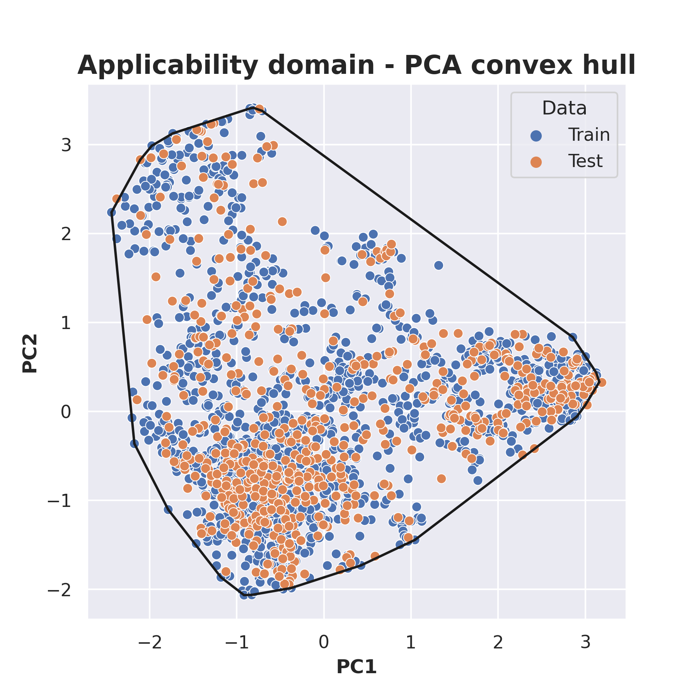

# MolAD
QSAR applicability domain
- This package is used to determine applicability domain of QSAR model
- 3 kinds of techniques are used:
1. Using PCA to reduce dimensionality of fingerprint and applying convexhull techniques to determine convex hull
- Result


## Requirements

This module requires the following modules:

- [RDkit](https://www.rdkit.org/)
- [scikit-learn](https://scikit-learn.org/stable/)

## Installation
Clone this repository to use

    
The folder structure should look like this:

    MolAD (project root)
    |__  README.md
    |__  MolAD
    |__  ultility
    |__  Data.csv
    |__ 
    |  
    |    
    |......
## Usage

```python

import os
import numpy as np
import pandas as pd
import matplotlib.pyplot as plt
import seaborn as sns
import sys
import sys
sys.path.append('MolAD')
from preprocessing import prepare_dataset
from pca_convexhull import PCA_convexhull
from pca_confelip import PCA_conf_elip
import warnings
warnings.filterwarnings('ignore')

from sklearn.model_selection import train_test_split
df_train, df_test = train_test_split(data, stratify = data.active, random_state = 42)

from rdkit import Chem, DataStructs 
from rdkit.Chem import Descriptors, Draw, PandasTools, AllChem
PandasTools.AddMoleculeColumnToFrame(df_train, smilesCol = 'Canomial_smiles')
PandasTools.AddMoleculeColumnToFrame(df_test, smilesCol = 'Canomial_smiles')

# 1. Data preprocessing: dekois is data before screening through pharmacophore model
process = prepare_dataset(data_train=df_train, data_test=df_test, smile_col ='Canomial_smiles',
                    activity_col='pChEMBL Value',feature_col = None,
                    mol_col = 'ROMol', ID = 'Molecule ChEMBL ID', fp_type='ECFPs')
process.fit()

# 2. Convex hull with PCA
convex = PCA_convexhull(data =process.df_pca, Type = 'Data', ID = 'ID', figsize = (6,6))
convex.convexhull_fit()

# 3. Confidence Elipse with PCA
elip = PCA_conf_elip(data =process.df_pca, Type = 'Data', ID = 'ID', figsize =(6,6))
elip.fit()

# 4. Smilarity matrix
simi = similarity_matrix(data_train=df_train, data_test=df_test, 
                         ID = 'Molecule ChEMBL ID', mol_col='ROMol',
                        function =AllChem.GetMorganFingerprintAsBitVect(mol, radius=2, nBits=2048))
simi.fit()

```
